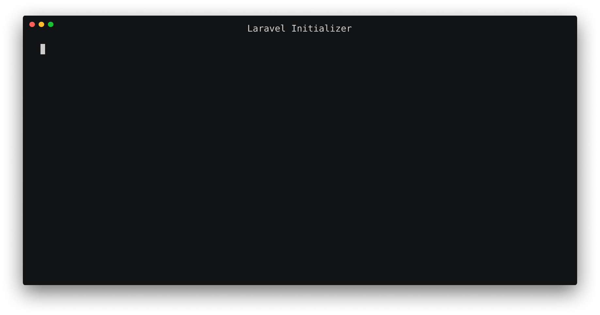

<p align="center">
    
</p>
<p align="center">A convenient way to <strong>initialize</strong> your application.</p>
<p align="center">
    <a href="https://packagist.org/packages/mad-web/laravel-initializer"></a>
    <a href="https://travis-ci.org/mad-web/laravel-initializer"></a>
    <a href="https://styleci.io/repos/100302581"></a>
    <a href="https://scrutinizer-ci.com/g/mad-web/laravel-initializer/code-structure"></a>
    <a href="https://scrutinizer-ci.com/g/mad-web/laravel-initializer"></a>
    <a href="https://packagist.org/packages/mad-web/laravel-initializer"></a>
    <a href="LICENSE.md"></a>
</p>
<p align="center">
    
</p>

## Introduction

We all know, that every application should contain readme file and **Installation** section with list of actions that you should to do for preparing an application to work.

Typical instruction:

- install dependencies
- run migrations
- publish assets
- compiling app assets
- make cron job for scheduler
- etc.

Some of actions you should do on every application update (composer update, git pull...) or branch change (git checkout) for preparing an application to work.

**Laravel Initializer** gives you the ability to declare these processes and run it by simple `app:install` and `app:update` artisan commands, which run predefined actions chain depending on the current environment.

Also `app:update` command could simplify your deploy script in Forge, Envoy.blade.php, laravel-deployer, ~~bash script~~ etc.

With Laravel Initializer you keep both of these processes in the source control.

> Put a knowledge of application initialization process into the right place

## Installation

Via Composer

``` bash
composer require mad-web/laravel-initializer
```

then publish initializer classes:

```bash
php artisan vendor:publish --tag=initializers
```

It will create `Install` and `Update` classes in `app` directory
which contains `local` and `production` methods according to different environments.
This methods should return runner chain with specific actions to install or update processes.

You can override config key which stores current environment value, publish config file and set `env_config_key` value.

```bash
php artisan vendor:publish --provider="MadWeb\Initializer\InitializerServiceProvider" --tag=config
```

_by default value is set to `app.env` for laravel, in most cases you don't need to override this value._

## Usage

Usage of `app:install` and `app:update` command are the same except that `app:install` uses `Install` class and `app:update` uses `Update` class.

Install class contents:

```php
namespace App;

use MadWeb\Initializer\Contracts\Runner;

class Install
{
    public function production(Runner $run)
    {
        $run->external('composer', 'install', '--no-dev', '--prefer-dist', '--optimize-autoloader')
            ->artisan('key:generate')
            ->artisan('migrate', ['--force' => true])
            ->artisan('storage:link')
//            ->dispatch(new MakeCronTask)
            ->external('npm', 'install', '--production')
            ->external('npm', 'run', 'production')
            ->artisan('route:cache')
            ->artisan('config:cache')
            ->artisan('event:cache');
    }

    public function local(Runner $run)
    {
        $run->external('composer', 'install')
            ->artisan('key:generate')
            ->artisan('migrate')
            ->artisan('storage:link')
            ->external('npm', 'install')
            ->external('npm', 'run', 'development');
    }
}
```

Update class contents:

```php
namespace App;

use MadWeb\Initializer\Contracts\Runner;

class Update
{
    public function production(Runner $run)
    {
        $run->external('composer', 'install', '--no-dev', '--prefer-dist', '--optimize-autoloader')
            ->external('npm', 'install', '--production')
            ->external('npm', 'run', 'production')
            ->artisan('route:cache')
            ->artisan('config:cache')
            ->artisan('event:cache')
            ->artisan('migrate', ['--force' => true])
            ->artisan('cache:clear')
            ->artisan('queue:restart'); // ->artisan('horizon:terminate');
    }

    public function local(Runner $run)
    {
        $run->external('composer', 'install')
            ->external('npm', 'install')
            ->external('npm', 'run', 'development')
            ->artisan('migrate')
            ->artisan('cache:clear');
    }
}
```

You can add any other method which should have the same name as your environment name, for example `staging`, and define different actions.

If you need to run actions with root privileges separately, you can define a method according to the following convention:

```php
namespace App;

use MadWeb\Initializer\Contracts\Runner;
use MadWeb\Initializer\Jobs\Supervisor\MakeQueueSupervisorConfig;
use MadWeb\Initializer\Jobs\Supervisor\MakeSocketSupervisorConfig;

class Install
{
    public function production(Runner $run) { ... }

    public function productionRoot(Runner $run)
    {
        $run->dispatch(new MakeQueueSupervisorConfig)
            ->dispatch(new MakeSocketSupervisorConfig)
            ->external('supervisorctl', 'reread')
            ->external('supervisorctl', 'update');
    }
}
```

Run it by passing "**root**" option:

```bash
artisan app:install --root
```

To see details of running actions use verbosity mode:

```bash
php artisan app:update -v
```

You can inject any service from [service container](https://laravel.com/docs/6.x/container) in constructor:

```php
class Update
{
    public function __construct(Filesystem $storage)
    {
        $this->storage = $storage;
    }
    // ...
}
```

If you want to move config classes from the `app` directory to a different place, rebind `app.installer` and `app.updater` keys of service container in the `AppServiceProvider`.

```php
$this->app->bind('app.installer', \AnotherNamespace\Install::class);
$this->app->bind('app.updater', \AnotherNamespace\Update::class);
```

### Runner API (available actions to run)

```php
$run
    ->artisan('command', ['argument' => 'argument_value', '-param' => 'param_value', '--option' => 'option_value', ...]) // Artisan command
    ->external('command', 'argument', '-param', 'param_value', '--option=option_value', ...) // Any external command by arguments
    ->external('command argument -param param_value --option=option_value') // Any external command by string
    ->callable(function ($arg) {}, $arg) // Callable function (like for call_user_func)
    ->dispatch(new JobClass) // Dispatch job task
    ->dispatchNow(new JobClass) // Dispatch job task without queue
    ->publish(ServiceProvider::class) // Publish single service provider assets
    ->publish([
        ServiceProvider::class,
        AnotherServiceProvider::class,
    ]) // Publish multiple packages assets
    ->publish([ServiceProvider::class => 'public']) // Publish package assets with tag
    ->publish([ServiceProvider::class => ['public', 'assets']]) // Publish package assets with multiple tags
    ->publishForce(ServiceProvider::class) // Force publish, works in any variations
    ->publishTag('public') // Publish specific tag
    ->publishTag(['public', 'assets']) // Publish multiple tags
    ->publishTagForce('public') // Force publish tags
```

### Laravel Nova

If you use [Laravel Nova](https://nova.laravel.com), don't forget to publish **Nova** assets on each update:

```php
// Update class
$run
    ...
    ->artisan('nova:publish')
    // or
    ->publishTag('nova-assets')
```

## Useful jobs

Laravel initializer provides some useful jobs to make initializing of your application much easier.

### Create cron task for scheduling tasks

To enable [Laravel Scheduling](https://laravel.com/docs/6.x/scheduling) add dispatch `MakeCronTask` job to runner chain to create cron task for your application.

```php
$run
    ...
    ->dispatch(new \MadWeb\Initializer\Jobs\MakeCronTask)
```

This job will add

```txt
* * * * * cd /path-to-your-project && php artisan schedule:run >> /dev/null 2>&1
```

to crontab list.

### Create laravel-echo-server.json config file

If you use [Laravel Echo Server](https://github.com/tlaverdure/laravel-echo-server) for broadcasting events in your application, add dispatch `MakeEchoServerConfig` job to runner chain to create configuration file.

```php
$run
    ...
    ->dispatch(new \MadWeb\Initializer\Jobs\MakeEchoServerConfig);
```

It will create configuration file with default options of [laravel-echo-server](https://github.com/tlaverdure/laravel-echo-server) and prefilled values from your laravel application configuration.

You can override default value by passing array into the job constructor. It would be a good practice to create additional config value for **laravel-echo-server** in `broadcasting.php` config:

```php
/*
|--------------------------------------------------------------------------
| Laravel Echo server configurations
|--------------------------------------------------------------------------
|
| Here you may define all of laravel echo server options
|
*/
'server' => [
    'authEndpoint' => '/broadcasting/auth',
    'port' => env('SOCKET_PORT', '6001'),
    'sslCertPath' => env('SSL_CERT', ''),
    'sslKeyPath' => env('SSL_PATH', '')
],
```

And pass these values to `MakeEchoServerConfig` job constructor.

```php
$run
    ...
    ->dispatch(new \MadWeb\Initializer\Jobs\MakeEchoServerConfig(config('broadcasting.server')));
```

### Create supervisor config file for queues

This job creates supervisor config file for queue workers.
Add dispatch `MakeQueueSupervisorConfig` job to runner chain.

```php
$run
    ...
    ->dispatch(new \MadWeb\Initializer\Jobs\Supervisor\MakeQueueSupervisorConfig);
```

This job creates configuration file with the command `php artisan queue:work --sleep=3 --tries=3` in `/etc/supervisor/conf.d/` folder by default, with a filename according to this convention `your-application-name-queue.conf`.

If you want to override default options, pass it into job constructor.
For example if you want to use [Laravel Horizon](https://laravel.com/docs/5.6/horizon) instead of default queue workers.

```php
$run
    ...
    ->dispatch(new \MadWeb\Initializer\Jobs\Supervisor\MakeQueueSupervisorConfig([
        'command' => 'php artisan horizon',
    ]));
```

### Create supervisor config file for laravel echo server

On the same way as `MakeQueueSupervisorConfig` job, you can use `MakeSocketSupervisorConfig` to create supervisor config file for launching laravel echo server.
The difference from `MakeQueueSupervisorConfig` is the command `node ./node_modules/.bin/laravel-echo-server start` and the config filename is `your-application-name-socket.conf`.

Both config files save log files to `your-app-path/storage/logs`.

## Installation by one command

For running `php artisan app:install` command, you should install composer dependencies at first.
It would be nice to have the ability to install an application by one command. We provide nice hack to implement this behavior.

Add `app-install` script into `scripts` section in `composer.json`.

```json
"scripts": {
    "app-install": [
        "@composer install",
        "@php artisan app:install"
    ],
}
```

Then you can run just

```bash
composer app-install
```

to initialize your application.

If your application has actions that require root privileges and you use Unix based system, add the following command into your runner chain:

```php
public function production(Runner $run)
{
    $run->artisan(...)
        ...
        ->external('sudo', 'php', 'artisan', 'app:install', '--root');
}

public function productionRoot(Runner $run) { ... }
```

## Safe Update

In cases when latest changes has been pulled from source control and some functionality of currently not installed package is used in one of a _Service Provider_ you will get an error. To prevent this issue you should make `composer install`
at first, to simplify this process you can define `app-update` script:

```json
"scripts": {
    "app-update": [
        "@composer install",
        "@php artisan app:update"
    ],
},
```

Then you can run:

```bash
composer app-update
```

## Upgrading

Please see [UPGRADING](UPGRADING.md) for details.

## Changelog

Please see [CHANGELOG](CHANGELOG.md) for more information what has changed recently.

## Testing

```bash
composer test
```

## Contributing

Please see [CONTRIBUTING](CONTRIBUTING.md) and [CONDUCT](CONDUCT.md) for details.

## Security

If you discover any security related issues, please email madweb.dev@gmail.com instead of using the issue tracker.

## Credits

Thanks [Nuno Maduro](https://github.com/nunomaduro) for [laravel-console-task](https://github.com/nunomaduro/laravel-console-task) package which gives pretty tasks outputs

- [Mad Web](https://github.com/mad-web)
- [All Contributors](../../contributors)

## License

The MIT License (MIT). Please see [License File](LICENSE.md) for more information.

[link-author]: https://github.com/mad-web
[link-contributors]: ../../contributors
